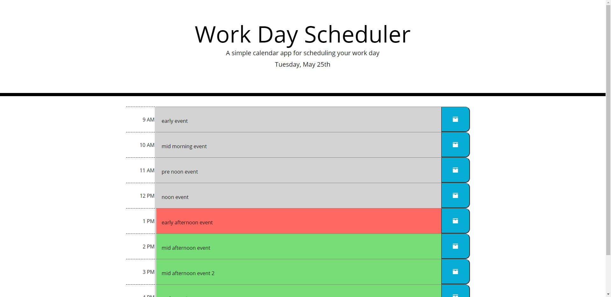
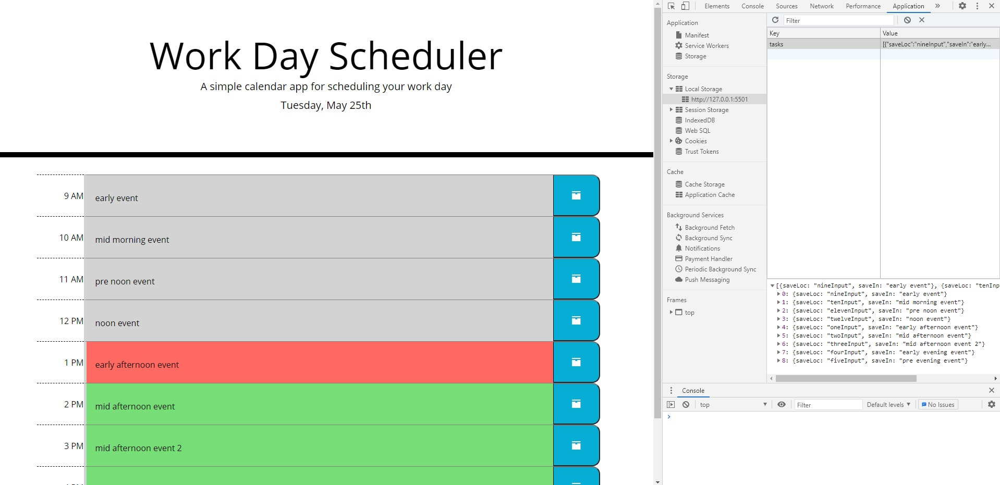

# Work Day Scheduler Challenge
The purpose of this project is to create a simple calendar application to save events for each hour of a standard business day. Runs in browser and uses HTML and CSS powered by jQuery.

### Criteria:
* Display current date at top of page when first loaded
* Contains time blocks at standard business hours
    * Blocks are colour-coded to indicate if they are:
        * Past
        * Present
        * Future
* Clicking on time block allows event to be added
    * Clicking save icon saves text for event in local storage
* Events saved persist when page refreshes 

### Web tools used
* HTML
* Javascript
* CSS
* jQuery
* Moment.js
* Bootstrap

## Website
https://zoomzooom6.github.io/Workday_Scheduler/

## Contribution
Designed by Tony Huang

## Final Results

### Main start page

### Proof of saving into local storage
